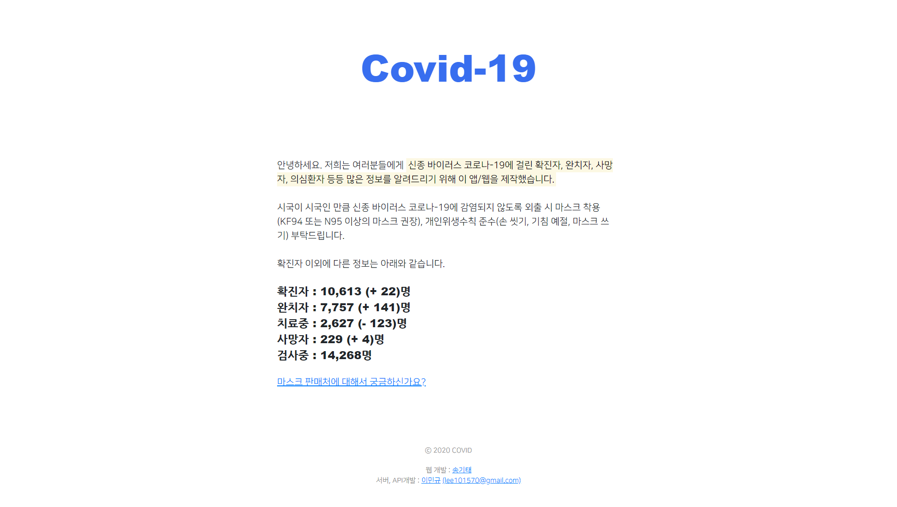

# Covid-19

## git-clone

```bash
$ git clone https://github.com/kitae0522/Covid-19.git
```

----------

## 1. Folder Structure

```shell
.
├── img
│   ├── favicon.ico
│   ├── covid-about.png
│   ├── covid-main.png
│   └── meta-image.png
├── all.js
├── main.js
├── main.css
├── index.html
└── README.md
```

## 2. Introduce
It is a web that crawls a lot of information on government sites such as confirmed cases, cured patients, deaths, suspected patients, etc. of the new virus Corona-19.

~~The project ends when the Corona-19 virus ends.~~
The service has been end. (based on 2020.04.21)

- Key Function
  - 📊 Provide number of confirmation cases
  - 📊 Provide information about the complete healer, person under treatment, death, and person under examination
  - 📢 Mask Seller Site Brokerage

## 3. Main-Page-Design

<div align="center">

  
  Main-Page-Design-Palette : #386eef, #ffffff

</div>

## 4. About-Page-Design

<div align="center">

  
  About-Page-Design-Palette : #386eef, #ffffff, #000000

</div>

## 5. Development Environment
- HTML5
- CSS3
- JS
- Bootstrap4
- VS Code

## 6. Developer Info
- Server : [MSUB HOSTING](http://msub.kr)
- Developer : Song Kitae, Lee Mingyu
- Feedback : kitae040522@gmail.com
- Address : ~~[https://corona.msub.kr](#)~~
- Viewport : Reactive
- Git : [http://github.com/kitae0522/Portfolio_2020](https://bit.ly/330FtBo)